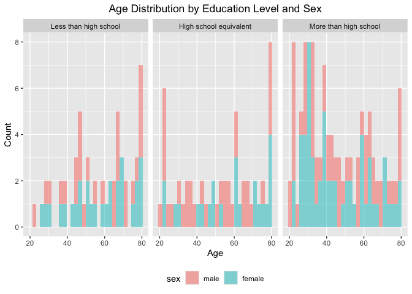
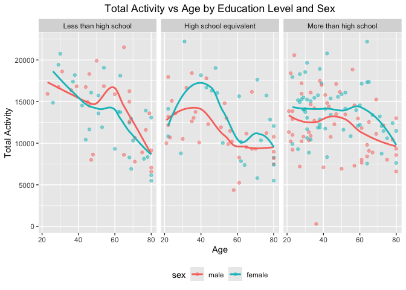
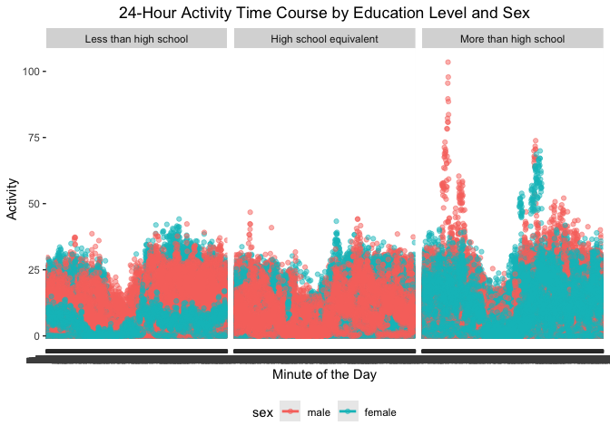

p8105_hw3_sl5685
================
Shumei Liu
2024-10-08

``` r
#Load necessary libraries
library(tidyverse)
```

    ## ── Attaching core tidyverse packages ──────────────────────── tidyverse 2.0.0 ──
    ## ✔ dplyr     1.1.4     ✔ readr     2.1.5
    ## ✔ forcats   1.0.0     ✔ stringr   1.5.1
    ## ✔ ggplot2   3.5.1     ✔ tibble    3.2.1
    ## ✔ lubridate 1.9.3     ✔ tidyr     1.3.1
    ## ✔ purrr     1.0.2     
    ## ── Conflicts ────────────────────────────────────────── tidyverse_conflicts() ──
    ## ✖ dplyr::filter() masks stats::filter()
    ## ✖ dplyr::lag()    masks stats::lag()
    ## ℹ Use the conflicted package (<http://conflicted.r-lib.org/>) to force all conflicts to become errors

### Problem 1

### Problem 2

``` r
#Load the datasets
accel_df = read_csv("data/nhanes_accel.csv") |>
  janitor::clean_names()
```

    ## Rows: 250 Columns: 1441
    ## ── Column specification ────────────────────────────────────────────────────────
    ## Delimiter: ","
    ## dbl (1441): SEQN, min1, min2, min3, min4, min5, min6, min7, min8, min9, min1...
    ## 
    ## ℹ Use `spec()` to retrieve the full column specification for this data.
    ## ℹ Specify the column types or set `show_col_types = FALSE` to quiet this message.

``` r
covar_df = read_csv("data/nhanes_covar.csv", skip = 4) |>
  janitor::clean_names()
```

    ## Rows: 250 Columns: 5
    ## ── Column specification ────────────────────────────────────────────────────────
    ## Delimiter: ","
    ## dbl (5): SEQN, sex, age, BMI, education
    ## 
    ## ℹ Use `spec()` to retrieve the full column specification for this data.
    ## ℹ Specify the column types or set `show_col_types = FALSE` to quiet this message.

``` r
#Tidy, merge, and otherwise organize the data sets.
whole_df = 
  left_join(accel_df, covar_df, by = "seqn") |>
  relocate(seqn, sex, age, bmi, education) |>
  filter(age >= 21) |>
  drop_na() |>
  mutate(education = 
           factor(education,
                  levels = c("1", "2", "3"),
                  labels = c("Less than high school", "High school equivalent", 
                                       "More than high school"))) |>
  mutate(sex = 
           factor(sex,
                  levels = c("1", "2"),
                  labels = c("male", "female")))

whole_df
```

    ## # A tibble: 228 × 1,445
    ##     seqn sex      age   bmi education     min1   min2   min3  min4   min5   min6
    ##    <dbl> <fct>  <dbl> <dbl> <fct>        <dbl>  <dbl>  <dbl> <dbl>  <dbl>  <dbl>
    ##  1 62161 male      22  23.3 High school… 1.11  3.12   1.47   0.938 1.60   0.145 
    ##  2 62164 female    44  23.2 More than h… 1.92  1.67   2.38   0.935 2.59   5.22  
    ##  3 62169 male      21  20.1 High school… 5.85  5.18   4.76   6.48  6.85   7.24  
    ##  4 62174 male      80  33.9 More than h… 5.42  3.48   3.72   3.81  6.85   4.45  
    ##  5 62177 male      51  20.1 High school… 6.14  8.06   9.99   6.60  4.57   2.78  
    ##  6 62178 male      80  28.5 High school… 0.167 0.429  0.131  1.20  0.0796 0.0487
    ##  7 62180 male      35  27.9 More than h… 0.039 0      0      0     0.369  0.265 
    ##  8 62184 male      26  22.1 High school… 1.55  2.81   3.86   4.76  6.10   7.61  
    ##  9 62189 female    30  22.4 More than h… 2.81  0.195  0.163  0     0.144  0.180 
    ## 10 62199 male      57  28   More than h… 0.031 0.0359 0.0387 0.079 0.109  0.262 
    ## # ℹ 218 more rows
    ## # ℹ 1,434 more variables: min7 <dbl>, min8 <dbl>, min9 <dbl>, min10 <dbl>,
    ## #   min11 <dbl>, min12 <dbl>, min13 <dbl>, min14 <dbl>, min15 <dbl>,
    ## #   min16 <dbl>, min17 <dbl>, min18 <dbl>, min19 <dbl>, min20 <dbl>,
    ## #   min21 <dbl>, min22 <dbl>, min23 <dbl>, min24 <dbl>, min25 <dbl>,
    ## #   min26 <dbl>, min27 <dbl>, min28 <dbl>, min29 <dbl>, min30 <dbl>,
    ## #   min31 <dbl>, min32 <dbl>, min33 <dbl>, min34 <dbl>, min35 <dbl>, …

``` r
#Produce table for the number of men and women in each education category
gender_edu_table = whole_df |>
  group_by(education, sex) |>
  summarise(count = n()) |>
  ungroup()
```

    ## `summarise()` has grouped output by 'education'. You can override using the
    ## `.groups` argument.

``` r
gender_edu_table
```

    ## # A tibble: 6 × 3
    ##   education              sex    count
    ##   <fct>                  <fct>  <int>
    ## 1 Less than high school  male      27
    ## 2 Less than high school  female    28
    ## 3 High school equivalent male      35
    ## 4 High school equivalent female    23
    ## 5 More than high school  male      56
    ## 6 More than high school  female    59

``` r
#Plot the age distributions for men and women in each education category
ggplot(whole_df, aes(x = age, fill = sex)) +
  geom_histogram(alpha = .5) +
  facet_wrap(~ education) +
  labs(title = "Age Distribution by Education Level and Sex", x = "Age", y = "Count") +
  theme(plot.title = element_text(hjust = 0.5)) +
  theme(legend.position = "bottom")
```

    ## `stat_bin()` using `bins = 30`. Pick better value with `binwidth`.

<!-- --> In
all three education levels, there are more males than females. In the
category of more than high school, young people are more than old
people, especially young females. In the category of less than high
school, there are more elderly people, especially elderly males.

``` r
#create a total activity variable for each participant
total_activity = whole_df |>
  rowwise() |>
  mutate(totalactivity = sum(c_across(min1:min1440)), na.rm = TRUE) |>
  relocate(totalactivity)
```

``` r
# Plot total activity(y) against age(x), with separate panels for each education level
ggplot(total_activity, aes(x = age, y = totalactivity, color = sex)) +
  geom_point(alpha = .5) +
  geom_smooth(method = "loess", se = FALSE) +
  facet_wrap(~ education) +
  labs(title = "Total Activity vs Age by Education Level and Sex", x = "Age", y = "Total Activity") +
  theme(plot.title = element_text(hjust = 0.5)) +
  theme(legend.position = "bottom")
```

    ## `geom_smooth()` using formula = 'y ~ x'

<!-- --> It
can be clearly seen from the chart that, regardless of education level
or gender, the older the less total activity time. From the charts for
high school level and more than high school, it can be seen that females
have more total activity time than males.

``` r
#Make a three-panel plot that shows the 24-hour activity time courses for each education level
activity_long = whole_df |>
  pivot_longer(
    min1:min1440,
    names_to = "minute", 
    values_to = "activity"
  )
  
#Plot the 24-hour activity time courses
ggplot(activity_long, aes(x = minute, y = activity, color = sex)) +
  geom_point(alpha = .5) +
  geom_smooth(method = "loess", se = FALSE) +
  facet_wrap(~ education) +
  labs(title = "24-Hour Activity Time Course by Education Level and Sex", 
       x = "Minute of the Day", 
       y = "Activity") +
  theme(plot.title = element_text(hjust = 0.5)) +
  theme(legend.position = "bottom")
```

    ## `geom_smooth()` using formula = 'y ~ x'

<!-- --> In
the more than high school category, females are more active than males.
In the high school level category, males have activity time more than
females. In the less than high school category, the ratio of males to
females is the same.

### Problem 3
